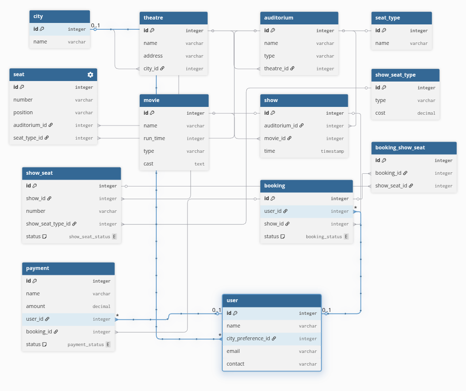

# book my show

## requirements
- Book my show is available in different cities
- Each city has many theatres
- Each theatre could have multiple auditoriums
- Auditoriums could be of different types to screen IMAX, 3D etc,.
- Every auditorium has multiple seats
- Each seat could be of different types
- Movies could be of different types such as 2D, 3D
- Users can do booking for one show at a time
- Users can pay via card, cash, UPI
- Each Booking could have multiple seats
- Users can book tickets until 1 hour before the show

## class diagram
### Iteration 1
city
- name
- list<theatre>

theatre
- name
- address
- list<auditorium>

auditorium
- name
- type
- list<seat>

seat -- this is structural seat, and doesn't bother about booking etc,.
- number
- position
- seat ENUM(seatType)

seatType
- name

### Iteration 2
movie
- name
- run time
- type
- cast
- list<show>

show
- auditorium
- movie
- time
- list<showSeat>

showSeat
- show
- number
- show seat type
- status ENUM (BOOKED|LOCKED|AVAILABLE)

showSeatType
- type
- cost -- this way, each show and the seat type could have its own cost

### Iteration 3
user
- name
- city preference
- email
- contact
- list<booking>

booking
- user
- show
- list<showSeat> -- could book more than one ticket
- status (SUCCESS|FAILED)
- list<payment> -- list of payments coz first could have failed, we might need that for refund processing etc

payment
- name
- amount
- user
- status (SUCCESS|FAILED|PROCESSING)

## Cardinalities
city 1:N theatre
theatre 1:N auditorium
auditorium 1:N seat
seat N:N seatType
movie 1:N show
show 1:N showSeat
showSeat N:N showSeatType
auditorium 1:N show
booking 1:N payment
booking 1:N showSeat
user 1:N booking

## Schema Design
